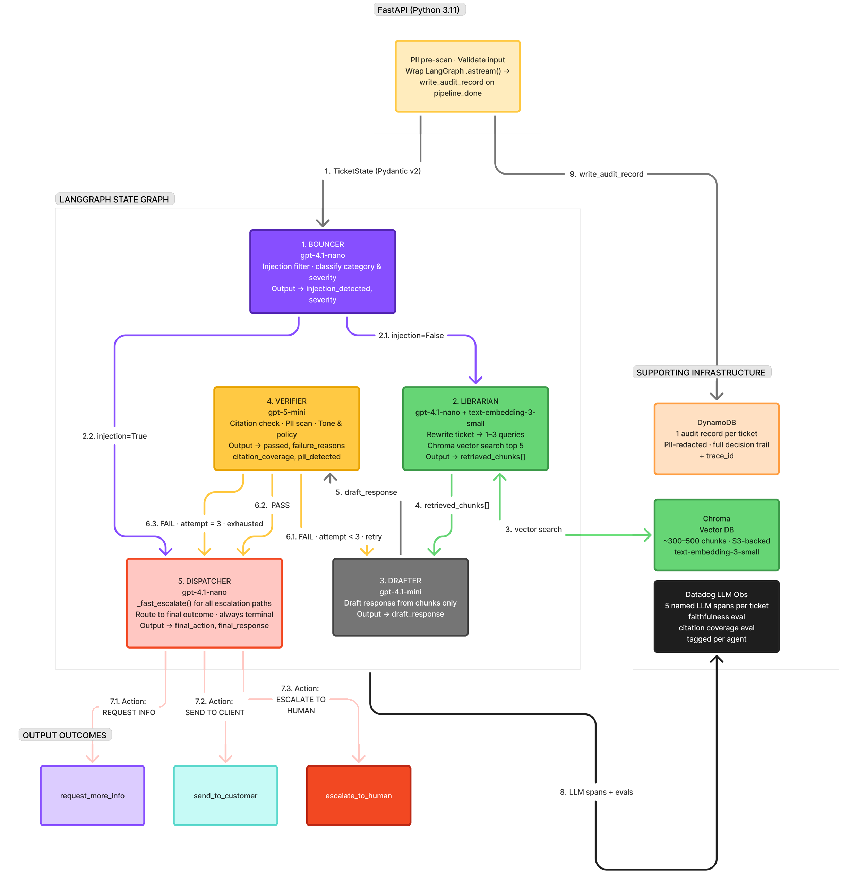
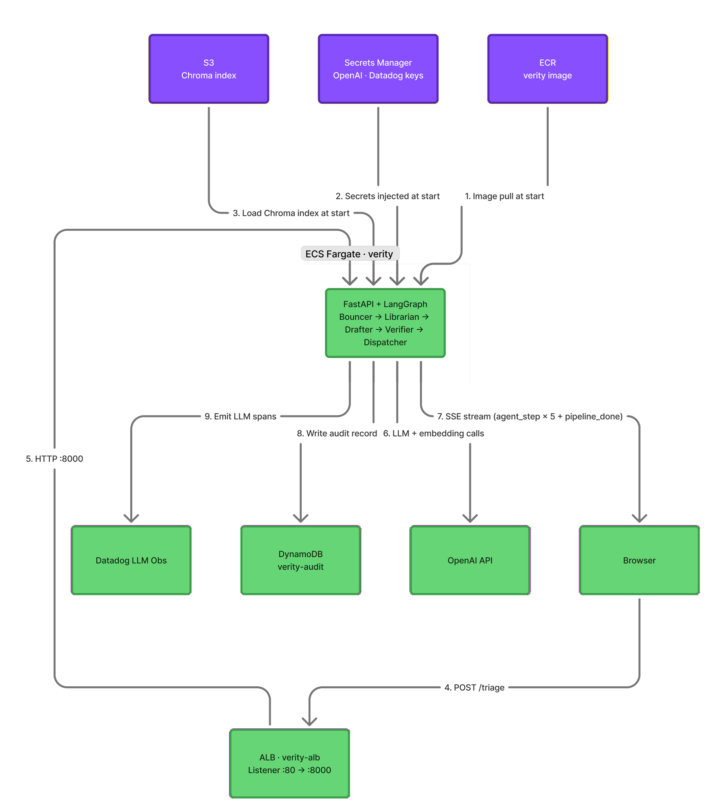

# Verity — The Citation-Grounded Support Triage Copilot

Verity is a **five-agent customer-support triage system**. Each incoming ticket is
classified, retrieved against a knowledge base, drafted, verified, and routed by a
chain of specialized AI agents — and **every customer-facing response is grounded in
retrieved internal documentation**, PII-screened, injection-checked, and fully traced
in Datadog LLM Observability.

Built as the Junior FDE pre-screening assignment — *Design and Implementation of a
Multi-Agent System* (Wipro, May 2026).

---

## 📋 Judges — Start Here

| Deliverable | Link |
|---|---|
| **Written Report** (1–2 page required writeup) | [`report.pdf`](report.pdf) |
| **Sample Prompts** (all 5 agent system prompts) | [`doc/PROMPTS.md`](doc/PROMPTS.md) |
| **Live Demo** | http://verity-alb-2072832666.us-east-1.elb.amazonaws.com/ *(see HTTP note below)* |
| **Architecture Diagram** | [Agent pipeline](#agent-architecture) · [AWS topology](#aws-deployment) |

---

## 🔗 Live Demo

**App / UI:** http://verity-alb-2072832666.us-east-1.elb.amazonaws.com/

> ### ⚠️ Important — this endpoint is plain **HTTP**, not HTTPS
>
> The demo deployment terminates on an AWS Application Load Balancer at **port 80**.
> A TLS certificate (ACM + custom domain) was deliberately descoped for the demo to
> avoid domain registration and cert-provisioning overhead. To open the link:
>
> 1. **Use the `http://` prefix explicitly.** Copy the full URL above — do not just
>    type the host, or the browser will silently try `https://` and fail to connect.
> 2. **Disable HTTPS auto-upgrade if the page won't load.** Chrome/Edge ship with
>    *"Always use secure connections"* enabled. If you see a connection error,
>    either click **"Continue to site (unsafe)"** or turn that setting off
>    (`Settings → Privacy and security → Security`).
> 3. **The "Not Secure" badge in the address bar is expected.** There is no login,
>    no account, and no PII input in this demo, so nothing sensitive crosses the
>    wire — the badge only reflects the missing TLS cert.
> 4. **The endpoint is ephemeral.** Per the cost-containment plan, the AWS stack is
>    torn down within ~24 hours of the presentation. If the link is down, run the
>    system locally — see [Running Locally](#-running-locally).

**Endpoints:**

| Path | Method | Purpose |
|---|---|---|
| `/` | GET | React single-page UI |
| `/health` | GET | Liveness check |
| `/triage` | POST | Submit a ticket; streams the pipeline back as SSE events |

Submit a ticket from the command line:

```bash
curl -N -X POST http://verity-alb-2072832666.us-east-1.elb.amazonaws.com/triage \
  -H "Content-Type: application/json" \
  -d '{"ticket_text":"How do I reset my password?","customer_id":"cust_001","channel":"email"}'
```

---

## Agent Architecture

Verity runs as a **sequential LangGraph pipeline** of five specialized agents, with
one conditional retry loop between the Drafter and Verifier, and hard escalation
exits at the Bouncer and Verifier. Agents never chat freely — they communicate only
through a typed Pydantic `TicketState` object passed node to node.



| # | Agent | Responsibility | Model |
|---|---|---|---|
| 1 | **Bouncer** | Validate input; classify category & severity; detect prompt injection | `gpt-4.1-nano` |
| 2 | **Librarian** | Rewrite ticket into 1–3 queries; vector search; return top-5 chunks | `gpt-4.1-nano` + `text-embedding-3-small` |
| 3 | **Drafter** | Write a customer reply **using only retrieved chunks** — no external knowledge, no tools | `gpt-4.1-mini` |
| 4 | **Verifier** | Check every claim maps to a chunk; PII scan; tone & policy check | `gpt-5-mini` (reasoning tier) |
| 5 | **Dispatcher** | Route to exactly one outcome: `send_to_customer`, `escalate_to_human`, or `request_more_info` | `gpt-4.1-nano` |

**Flow control:** the Bouncer routes confirmed injection attempts straight to human
escalation. A failed verification triggers up to **2 retries** of the Drafter; once
3 attempts are exhausted the Verifier forces escalation. Reasoning capacity is
concentrated at the Verifier — the one place where a missed hallucination is most
expensive.

---

## AWS Deployment

The entire system runs as a **single ECS Fargate container** (FastAPI + LangGraph
backend serving the React build as static assets) behind a public Application Load
Balancer. One container, one origin — no CORS surface in production.



| Component | Role |
|---|---|
| **ALB** (`verity-alb`) | Public ingress, listener `:80 → :8000` |
| **ECS Fargate** (`verity`) | 0.25 vCPU / 512 MB task running the FastAPI + LangGraph app |
| **ECR** | Container image registry |
| **S3** | Stores the prebuilt Chroma vector index, downloaded at container start |
| **Secrets Manager** | OpenAI + Datadog API keys, injected as env vars at task start |
| **DynamoDB** (`verity-audit`) | One PII-redacted audit record per ticket |
| **Datadog LLM Obs** | Five named LLM spans per ticket + faithfulness / citation-coverage evals |

Infrastructure is defined as code in [`infra/main.tf`](infra/main.tf) (Terraform).
Full step-by-step deployment runbook is in [`PRD.md`](PRD.md) Section 10, Phase 4.

---

## How This Project Answers the Assignment

The assignment ([`Project Assignment Multi-Agent System.md`](Project%20Assignment%20Multi-Agent%20System.md))
requires the submission to address four areas. Here is where each is covered.

### 1. Multi-Agent Architecture
Five specialized agents — Bouncer, Librarian, Drafter, Verifier, Dispatcher — with
clear responsibilities and boundaries (table above). Agents operate **sequentially**
through a LangGraph state machine with one conditional retry loop; communication is
via a typed shared state object, not free-form chat. See [`PRD.md`](PRD.md) §7 and
[`agent_system_diagram.png`](agent_system_diagram.png).

### 2. Security, Safety, and Guardrails
- **Input validation** — 4,000-character cap and structural checks before any LLM call.
- **Prompt-injection protection** — regex pre-filter + LLM classifier in the Bouncer;
  confirmed attacks bypass the pipeline, are quoted but **never executed**.
- **Output filtering** — the Verifier rejects any uncited claim, PII leak, or
  off-policy/off-tone content before a response can be sent.
- **Data handling** — PII is redacted before anything is written to DynamoDB or logs;
  API keys live in AWS Secrets Manager, never in code, logs, or Terraform state.
- **Least privilege** — the Fargate task role can read exactly two secrets, write to
  one DynamoDB table, and read one S3 bucket. No agent has shell, network, or
  arbitrary DB access. Guardrail code: [`backend/verity/guardrails.py`](backend/verity/guardrails.py).

### 3. Implementation Approach
- **Stack** — Python 3.11, LangGraph (orchestration), Pydantic v2 (state validation),
  FastAPI (API), Vite + React + TypeScript + Tailwind (UI), Chroma (vector store),
  OpenAI (LLMs), Datadog (observability), DynamoDB (audit), ECS Fargate + ALB (AWS).
- **Error handling** — exponential backoff on OpenAI 429/5xx, schema-parse retries,
  and a deterministic `escalate_to_human` fallback on any unhandled exception.
- **Testing** — `pytest` unit tests plus a 30-ticket offline eval suite
  ([`scripts/run_eval.py`](scripts/run_eval.py)) covering retrieval precision,
  injection detection, and PII leakage.

### 4. Use of AI / LLMs and Collaboration
LLMs are used for classification, query rewriting, grounded drafting, and reasoning-
based verification — each agent on the cheapest model that fits its job, with the
reasoning-tier model reserved for the Verifier. Agents "collaborate" through the
Drafter↔Verifier critique loop: the Verifier returns structured failure reasons that
the Drafter consumes on retry. The autonomy/control trade-off is resolved toward
**control** — verification is mandatory, retries are bounded, and every path
terminates in a single auditable routing decision. All five agent system prompts
and their user-message templates are documented in [`doc/PROMPTS.md`](doc/PROMPTS.md).

---

## Repository Guide — Key Documents

| Document | What it contains |
|---|---|
| [`PRD.md`](PRD.md) | Full product spec — architecture, schemas, NFRs, phase-by-phase build & deploy plan |
| [`Project Assignment Multi-Agent System.md`](Project%20Assignment%20Multi-Agent%20System.md) | The original assignment brief |
| [`report.pdf`](report.pdf) | The 1–2 page written report (required deliverable) |
| [`doc/PROMPTS.md`](doc/PROMPTS.md) | All five agent system prompts + user-message templates (*Sample Prompts* deliverable) |
| [`doc/SYNTHETIC_DATA.md`](doc/SYNTHETIC_DATA.md) | How the KB corpus and eval set were generated |
| [`agent_system_diagram.png`](agent_system_diagram.png) | Agent pipeline / LangGraph state graph |
| [`AWS_system_design.png`](AWS_system_design.png) | AWS deployment topology |
| [`data/evals/`](data/evals/) | 30-ticket evaluation set + its README |
| [`data/kb/`](data/kb/) | 60 synthetic knowledge-base markdown documents |
| [`infra/main.tf`](infra/main.tf) | Terraform IaC for the full AWS stack |

```
backend/    Python 3.11 — FastAPI + LangGraph (agents, prompts, guardrails, API)
frontend/   Vite + React + TypeScript + Tailwind single-page UI
data/kb/    60 KB markdown documents
data/evals/ 30 annotated eval tickets
infra/      Terraform IaC
scripts/    KB ingestion, eval runner, stress test
```

---

## 🖥️ Running Locally

Prerequisites: Python 3.11, Node 18+, an OpenAI API key.

```bash
# 1. Configure environment
cp .env.example .env          # then fill in OPENAI_API_KEY (Datadog keys optional)

# 2. Backend
cd backend
pip install -e ".[dev]"
python ../scripts/ingest_kb.py          # build the Chroma index from data/kb/
uvicorn verity.api:app --reload         # serves on http://localhost:8000

# 3. Frontend (separate terminal)
cd frontend
npm install
npm run dev                             # serves on http://localhost:5173
```

Quick checks without the UI:

```bash
# CLI smoke test — runs one ticket through the full pipeline
python -m verity.cli "How do I reset my password?"

# Offline eval suite (30 tickets)
python scripts/run_eval.py
```

> The Datadog keys in `.env` are optional for local development — the pipeline runs
> without them; only the Observability spans are skipped.

---

See [`PRD.md`](PRD.md) for the complete specification.
