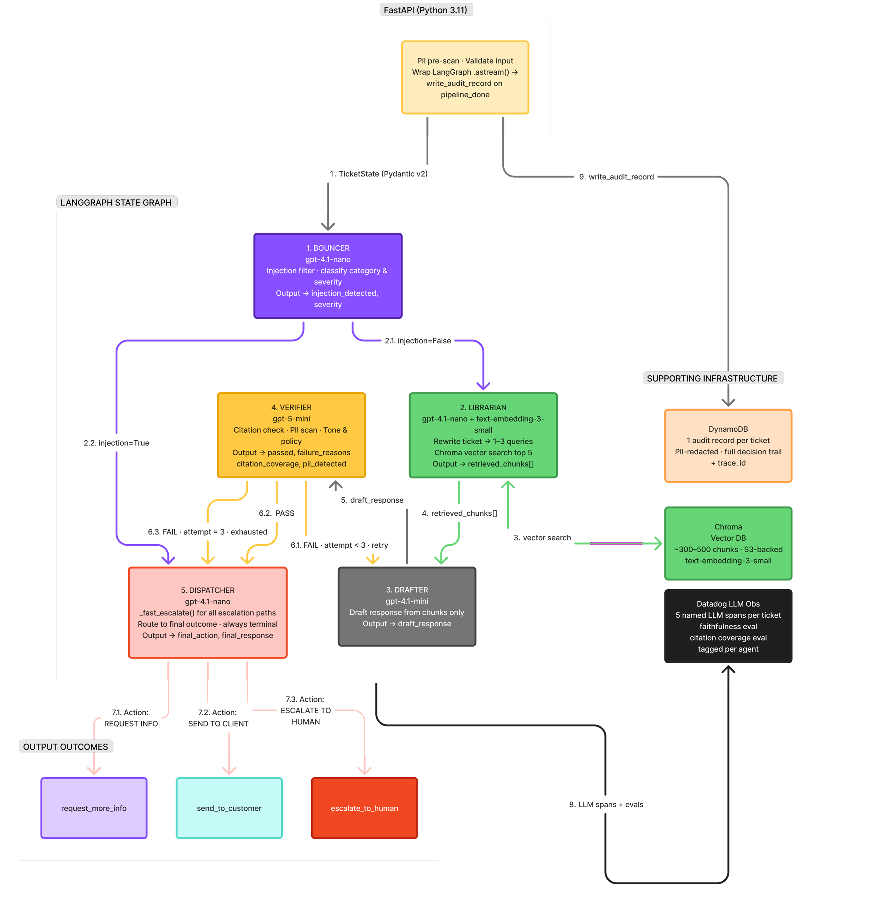

# Verity — The Citation-Grounded Support Triage Copilot

Verity is a **five-agent customer-support triage system**. Each incoming ticket is
classified, retrieved against a knowledge base, drafted, verified, and routed by a
chain of specialized AI agents — and **every customer-facing response is grounded in
retrieved internal documentation**, PII-screened, and injection-checked.

This README covers running Verity on your own machine.

---

## Agent Architecture

Verity runs as a **sequential LangGraph pipeline** of five specialized agents, with
one conditional retry loop between the Drafter and Verifier, and hard escalation
exits at the Bouncer and Verifier. Agents never chat freely — they communicate only
through a typed Pydantic `TicketState` object passed node to node.



| # | Agent | Responsibility | Model |
|---|---|---|---|
| 1 | **Bouncer** | Validate input; classify category, severity & Ticket complexity (simple/complex); detect prompt injection | `gpt-4.1-nano` |
| 2 | **Librarian** | Rewrite ticket into 1 query (simple) or 2–3 Sub-queries (complex); vector search; Rerank; Fair merge into the top-5 chunks | `gpt-4.1-nano` + `text-embedding-3-small` + local Qwen3-Reranker-0.6B |
| 3 | **Drafter** | Write a customer reply **using only retrieved chunks** — no external knowledge, no tools | `gpt-4.1-mini` |
| 4 | **Verifier** | Check every claim maps to a chunk; PII scan; tone & policy check | `gpt-5-mini` (reasoning tier) |
| 5 | **Dispatcher** | Route to exactly one outcome: `send_to_customer`, `escalate_to_human`, or `request_more_info` | `gpt-4.1-nano` |

Models shown are the defaults. Every chat and embedding call goes through the
[LiteLLM](https://github.com/BerriAI/litellm) SDK, so each agent's model is set with
`BOUNCER_MODEL`, `LIBRARIAN_MODEL`, `DRAFTER_MODEL`, `VERIFIER_MODEL` and
`DISPATCHER_MODEL`, and the embedding model with `EMBED_MODEL` (see
[ADR 0002](docs/adr/0002-litellm-for-all-model-calls.md)).

**Retrieval:** each Retrieval query fetches candidates from Chroma. When the reranker is
on (`RERANKER_MODE=qwen`, the default), each query fetches 20 candidates and reranks them
against its own query; otherwise it fetches the top 5 by cosine. The per-query results
are combined by a **Fair merge** — each query's #1, then each query's #2, and so on until
five Chunks are chosen — so every part of a complex ticket is represented (see
[ADR 0001](docs/adr/0001-fair-merge-over-score-sort.md)). Each Chunk carries its own score
and score kind (`cosine` or `rerank`), and the final list is shown in merge order. The
embedding model is tied to the Chroma index: changing `EMBED_MODEL` requires re-running
`scripts/ingest_kb.py`, and Verity refuses to query an index built with a different model.

**Flow control:** the Bouncer routes confirmed injection attempts straight to human
escalation. A failed verification triggers up to **2 retries** of the Drafter; once
3 attempts are exhausted the Verifier forces escalation.

---

## Results: Effect of Adding the Reranker

Measured on the 30-ticket eval set ([`scripts/run_eval.py`](scripts/run_eval.py)):

| Metric | Baseline | After (ticket_4) |
|---|---|---|
| Pipeline pass rate | 71.0% | 83.9% |
| Injection detection | 100% | 100% |
| PII leaks | 0 | 0 |
| Retrieval precision@5 | 0.563 | 0.563 |
| Retrieval recall@5 | 0.722 (misses 0.8 target) | 0.840 (meets target) |

---

## Repository Layout

```
backend/    Python 3.11 — FastAPI + LangGraph (agents, prompts, guardrails, API)
frontend/   Vite + React + TypeScript + Tailwind single-page UI
data/kb/    60 synthetic knowledge-base markdown documents
data/evals/ 30 annotated eval tickets
scripts/    KB ingestion, eval runner, stress test
models/     Local model weights (you create this — see below)
```

Further reading: [`PRD.md`](PRD.md) (full spec), [`GLOSSARY.md`](GLOSSARY.md) (domain
vocabulary), [`docs/adr/`](docs/adr/) (architecture decisions).

---

## Running Locally

Prerequisites: Python 3.11, Node 18+, and an API key for your model provider (OpenAI by default).

### 1. Configure environment

```bash
cp .env.example .env          # then fill in OPENAI_API_KEY
```

The Datadog keys in `.env` are optional — the pipeline runs without them; only the
observability spans are skipped.

### 2. Add the reranker weights

The reranker is on by default (`RERANKER_MODE=qwen`), so create a `models/` folder at the
repo root and put the Qwen3-Reranker-0.6B weights in it:

```bash
mkdir -p models
huggingface-cli download Qwen/Qwen3-Reranker-0.6B --local-dir models/Qwen3-Reranker-0.6B
```

The weights must end up at `models/Qwen3-Reranker-0.6B` (or point `RERANKER_MODEL_DIR` at
another location). The server refuses to start if they are missing. To run without
reranking, set `RERANKER_MODE=none` and skip this step.

### 3. Backend

```bash
cd backend
pip install -e ".[dev,rerank]"          # drop ",rerank" if you set RERANKER_MODE=none
python ../scripts/ingest_kb.py          # build the Chroma index from data/kb/
                                        # (re-run whenever EMBED_MODEL changes)
uvicorn verity.api:app --reload         # serves on http://localhost:8000
```

### 4. Frontend (separate terminal)

```bash
cd frontend
npm install
npm run dev                             # serves on http://localhost:5173
```

### API endpoints

On `http://localhost:8000`:

| Path | Method | Purpose |
|---|---|---|
| `/` | GET | React single-page UI |
| `/health` | GET | Liveness check |
| `/triage` | POST | Submit a ticket; streams the pipeline back as SSE events |

```bash
curl -N -X POST http://localhost:8000/triage \
  -H "Content-Type: application/json" \
  -d '{"ticket_text":"How do I reset my password?","customer_id":"cust_001","channel":"email"}'
```

### Quick checks without the UI

```bash
# CLI smoke test — runs one ticket through the full pipeline
python -m verity.cli "How do I reset my password?"

# Offline eval suite (30 tickets)
python scripts/run_eval.py
```

The triage response and the eval metrics file record which reranker mode was used.
